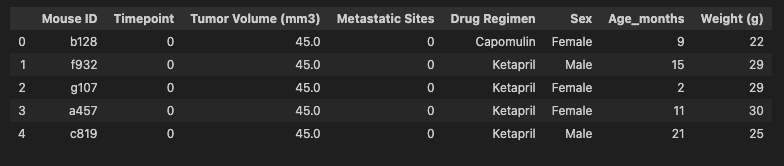

# Pymaceuticals

# Conclusions
- There are more observations for the regimens Capomulin and Ramicane.
- The number of female mice and male mice for the study is almost the same, with 51% male mice and 49% female mice.
- The standard deviation of the average Tumor Volume is low for all the treatments, which means the results are not very spread. This can also be confirmed with only observing one outlier among the last observation for treatments with Capomulin, Ramicane, Infubino and Ceftamin.
- Among the 4 treatments analyzed, the best results were observed with Capomulin and Ramicane, where the average final tumor volumes where smaller.
- Mouse v923 had a big drop in the tumor volume in the first 10 days of treatment with Capomulin, going from 45mm3 to 39.84 mm3. It remained stable until day 20 and increased to 42.15 when observed on day 40 when finally dropped to 40.65 during the final observation on day 25.
- For the Capomulin treatment there is a strong positive correlation between the mouse weight and the average tumor volume.

# Background

You've just joined Pymaceuticals, Inc., a new pharmaceutical company that specializes in anti-cancer medications. Recently, it began screening for potential treatments for squamous cell carcinoma (SCC), a commonly occurring form of skin cancer.

As a senior data analyst at the company, you've been given access to the complete data from their most recent animal study. In this study, 249 mice who were identified with SCC tumors received treatment with a range of drug regimens. Over the course of 45 days, tumor development was observed and measured. The purpose of this study was to compare the performance of Pymaceuticals’ drug of interest, Capomulin, against the other treatment regimens.

The executive team has tasked you with generating all of the tables and figures needed for the technical report of the clinical study. They have also asked you for a top-level summary of the study results.

# Prepare the data.
Merged data

Number of Mice

Duplicate

Clean Data

Final number of Mice

# Generate summary statistics.

# Create bar charts and pie charts.

# Calculate quartiles, find outliers, and create a box plot.

# Create a line plot and a scatter plot.

# Calculate correlation and regression.

